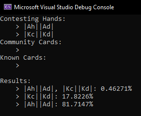

# Poker Win Analyser

This is a C++ console application that can be used to determine the frequency at which players win an incomplete hand of Texas Hold'em poker.

On many modern poker games and television programs, the chance of each player winning the hand is displayed on the screen. This program intends to not only replicate this but to include more information, such as all possible ties.

Currently, the implementation focusses entirely on Texas Hold'em, but in the future it may be extended to account for other poker variants.

## Language

This program was coded in the Microsoft Visual Studio Community 2019 IDE (Version 16.11.7) using C++ 17.

## Instructions

1. Either (a) clone or (b) download and extract the repository to the root folder of an empty C++ console application project.
2. Compile and run.

## Screenshot

## Problems
- The execution time is far too long relative to other implementations. There's an app on the Google Play / App Store called 'Poker Calculator' which has the same functionality as this program but with a quick and intuitive GUI. It's able to calculate the same results significantly faster than this program. Perhaps it employs multithreading in some clever way.
